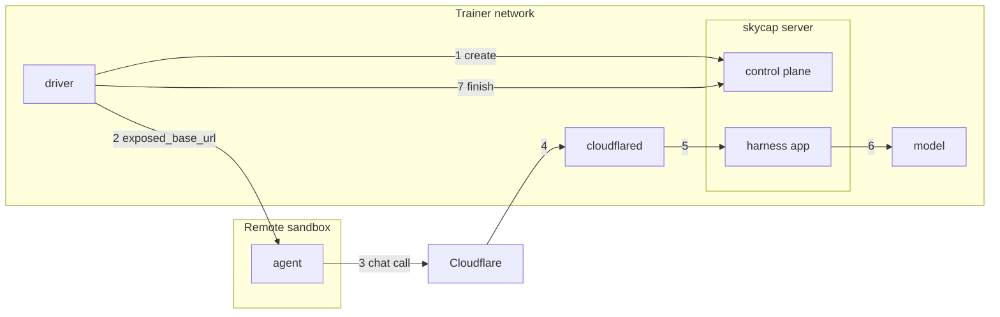

# skycap

Trajectory capture for RL rollouts. A harness points its unchanged OpenAI client
at a per-trajectory URL. skycap records every model call into a context graph —
one node per message, where resamples, subagents, compaction and harness edits
are forks — and, when the trajectory finishes, returns training samples: by
default one per root-to-leaf path.

skycap is its own package inside this repository and does not depend on
`skyrl`.

## Run a server

Text mode forwards to any OpenAI-compatible server and records what it sees:

```bash
cd skycap && uv sync
uv run skycap serve --upstream-url http://engine:8000/v1 --record-dir ./record
```

Token mode renders the prompt itself through
[`renderers`](https://github.com/PrimeIntellect-ai/renderers) and calls a
token-in/token-out engine, so the stored tokens are the ones inference saw,
with logprobs, routed experts and sampling masks:

```bash
uv sync --extra tokens
uv run skycap serve --mode tokens --upstream-url http://engine:8000 \
  --tokenizer Qwen/Qwen3-8B --max-model-len 32768 \
  --sampling-overrides '{"top_k": 50}' --sampling-mask --record-dir ./record
```

The engine is vLLM, over its own `/inference/v1/generate`. Another engine's wire
is a subclass of `skycap.tokens.engine.VLLMEngine`.

By default a reply is parsed: a thinking model's reasoning comes back as
`reasoning_content`, and tool calls as `tool_calls`. Add `--use-raw-content`
when the harness was written against a vLLM server with no reasoning or tool
parser. Replies then match that server's: the completion's own text as
`content`, with thinking inline and tool calls unparsed, and
`reasoning_content: null`. A harness that replays `content` and drops
`reasoning_content` (Terminus-2 through LiteLLM, for example) then sends each
turn back unchanged, and a thinking model's history stays one path. With parsed
replies, every replayed turn would lose its thinking and fork the graph.

### Images

A vision-language model's messages carry images as OpenAI `image_url` content
parts. The renderer processes them with the model's Hugging Face processor and
lays out their placeholder tokens; every call sends the engine all the images
in its prompt (vLLM's `features`), and each image is stored on the message
node that sent it. A sample lists its path's images in order, with their
placeholder offsets in `input_ids` and the processor's arrays
(`pixel_values`, `image_grid_thw` for Qwen-VL), which is what training needs:

```bash
uv sync --extra tokens --extra multimodal   # plus torch and torchvision, for the processor
uv run skycap serve --mode tokens --upstream-url http://engine:8000 \
  --tokenizer Qwen/Qwen3-VL-8B-Instruct --processor-kwargs '{"max_pixels": 1003520}' --record-dir ./record
```

`--processor-kwargs` must match the engine's `mm_processor_kwargs`: an image
processed differently has a different number of placeholders than the engine
expects. Encoding the images for the engine needs `vllm` installed beside
skycap.

## Embed a server

A trainer can run a server in its own process instead, from the same options
`skycap serve` takes. It gets a thread and event loop of its own:

```python
from skycap import CaptureService

service = CaptureService(
    "http://engine:8000", mode="tokens", tokenizer="Qwen/Qwen3-8B",
    max_model_len=32768, record_dir="./record",
)
url = service.start()        # hand this to a CapturePool
...
service.stop()               # writes the trajectories still in memory
```

How a call reaches the model is built inside from those options. An engine
with another wire passes `engine=` (a `skycap.tokens.engine.VLLMEngine`
subclass), which is the one piece an embedder supplies.

## Expose a server to remote harnesses

A harness that runs outside the server's network, such as an agent inside a
remote sandbox (Daytona, Modal), can't reach the server's own URL. With an
exposure, the server listens a second time with the harness routes alone
(`/t/{id}/v1/chat/completions` and `/models`; no control plane is routed
there), and the exposure makes that listener reachable:

```bash
# A Cloudflare quick tunnel: outbound internet only, no account, development only.
uv run skycap serve --upstream-url http://engine:8000/v1 --expose cloudflare
# An address the sandboxes route to: this node's, or a relay's (frp on a public VM) forwarding the port here.
uv run skycap serve --upstream-url http://engine:8000/v1 \
  --expose external_host --expose-kwargs '{"host": "203.0.113.7", "port": 11500}'
```

There is one exposed URL per server: the server opens its exposure once, when
it starts. A trajectory's route on it is that URL plus the trajectory's own
path, `/t/{id}/v1`, so `create` returns it with the trajectory, as
`exposed_base_url` beside `base_url`. The id in the path tells trajectories
apart there, exactly as on the server's own URL.



1. The driver creates a trajectory on the server's own URL and gets its `exposed_base_url`.
2. It hands that URL to the agent in the remote sandbox.
3. The agent calls it, which reaches Cloudflare.
4. Cloudflare forwards the call over the tunnel `cloudflared` dialed out from the trainer network.
5. `cloudflared` hands it to the server's harness app, which serves the harness routes and nothing else.
6. skycap records the call and gets the reply from the model.
7. The driver finishes the trajectory on the server's own URL and gets the training samples.

```python
from skycap import CapturePool, CaptureService
from skycap.exposure import load_exposure

service = CaptureService(
    "http://engine:8000", mode="tokens", tokenizer="Qwen/Qwen3-8B",
    record_dir="./record", exposure=load_exposure("cloudflare"),
)
url = service.start()            # returns once the tunnel is up
service.exposed_url              # https://<random>.trycloudflare.com

async with CapturePool([url]) as pool:
    async with pool.trajectory({"task": "t1"}) as trajectory:
        trajectory.base_url          # http://10.0.0.5:41234/t/tr_.../v1, in this network
        trajectory.exposed_base_url  # https://<random>.trycloudflare.com/t/tr_.../v1, from anywhere
        await run_agent_in_sandbox(base_url=trajectory.exposed_base_url)  # any OpenAI client
        result = await trajectory.finish({"reward": 1.0})

service.stop()                   # closes the tunnel, then writes what is still in memory
```

| `--expose` | Reached at | Limits |
| --- | --- | --- |
| `cloudflare` | a random `https://*.trycloudflare.com` URL | development only: at most 200 requests in flight per tunnel (more get 429), a response that hasn't started within ~125 s gets 524, no SLA. Adds ~20 ms per call. |
| `external_host` | `http://{host}:{port}` | plain HTTP; the address has to route to this node |
| `pkg.module:Class` | whatever the class returns | an `skycap.exposure.Exposure` subclass, built with `--expose-kwargs` |

A custom way in implements three methods; the server binds the listener at
`bind()`, calls `start` once it serves, and `stop` before it stops:

```python
class Exposure:
    def bind(self) -> tuple[str, int]: ...      # default: a free loopback port, for a tunnel
    def start(self, harness_url: str) -> str: ... # make harness_url reachable; return the URL callers use
    def stop(self) -> None: ...
```

cloudflared is taken from `PATH` or downloaded once (Linux), and is tied to the
server's process: it stops when that process exits, however it exits.

The timeouts around it (starting the server with an exposure, the cloudflared
download, how long a stop waits for an exposure that is still opening) are
environment variables, listed with their defaults in `skycap/env_vars.py`.

## Capture a rollout

```python
from skycap import CapturePool

pool = CapturePool(["http://capture-0:8080", "http://capture-1:8080"])
async with pool.trajectory({"task": "t1", "step": 3}) as trajectory:
    run_harness(base_url=trajectory.base_url, api_key=trajectory.api_key)  # any OpenAI client
    result = await trajectory.finish({"reward": 1.0})

result.status          # "finished", or "failed" if a turn couldn't be attributed exactly
for sample in result.samples:
    sample.input_ids, sample.loss_mask, sample.logprobs
    sample.routed_experts, sample.sampling_mask, sample.media
```

A token-mode call may bound its own prompt with `max_prompt_tokens` in the
body (`extra_body` in the OpenAI SDK): a longer prompt is refused with
`context_length_exceeded` before inference, and the trajectory stays open.

Creates go round-robin over the servers, and each trajectory's URL names its
server, so no router or load balancer is involved. An SDK retry
(`x-stainless-retry-count`) gets the original call's reply rather than a second
sample.

### Per-trajectory API keys

`create` mints an API key for each trajectory (`trajectory.api_key`). A server
started with `--require-api-key` (`CaptureService(require_api_key=True)`)
answers a trajectory's harness routes only when the call carries that key as
`Authorization: Bearer <key>`, which is what an OpenAI client does with its
`api_key`. Use it when the routes are reachable from outside the trainer's
network, for an agent in a remote sandbox: a caller who learns a trajectory's
URL can't add calls to it without its key, and a key opens no other
trajectory. The control plane is not keyed. A key lives only in memory: it is
never written to the record, and it stops working when the trajectory ends.

### Which paths train

`finish` returns a sample per root-to-leaf path of the graph, each sampled
message a target in exactly one of them. `finish(..., paths="final")` returns
only the path to the reply of the trajectory's last model call, with every
sampled message on it a target: branches off it, such as a reply the harness
discarded and asked again for, don't train. It takes the last call to be the
main loop's; a harness whose side calls (a subagent, a summarizer) can return
after that needs a custom rule.

Those are the two built-in path rules (`skycap.paths`). A custom rule is a
function of the graph that returns rows, each a path from a root and the model
nodes on it to train. skycap builds the samples (tokens, loss masks, routes)
from the rows, after checking that each path follows parent links, every target
is a model node on its path, and no node is a target twice:

```python
from skycap.graph import MessageGraph
from skycap.paths import Row, final_path

def last_reply(graph: MessageGraph) -> list[Row]:
    """Only the final reply trains, with the conversation before it as context."""
    return [Row(row.path, row.targets[-1:]) for row in final_path(graph)]

service = CaptureService(..., path_rules={"last_reply": last_reply})  # or "my_rules:last_reply"
await trajectory.finish({"reward": 1.0}, paths="last_reply")
```

A server accepts only the rules it was given, so a request never imports code.
`skycap serve --path-rule last_reply=my_rules:last_reply` does the same;
without `NAME=`, a rule is named by its import path. The record's `samples`
field says which rule trained a trajectory, and a repeated `finish` can't ask
for another one. A rule that raises fails the `finish` with `PathRuleError`
(HTTP 500, `"code": "path_rule_failed"`); the trajectory is still ended and
written, without samples, and a later `finish` runs the rule again.
`pool.trajectory(meta, paths=...)` sets the rule a trajectory is finished
with, including when its block raises before finishing.

## The record

Each trajectory is written once, when it ends (finish, idle TTL or graceful
shutdown): a document, plus sidecars for tokens (with the text they decode to
and each token's offset in it), routed experts and sampling masks. The format
is specified in [`docs/format.md`](docs/format.md), which is what any reader,
such as the viewer, implements.

`result.record` says where it is: `path` on the server's disk and, with a
mirror, its `mirror` URI (`result.record.uri` is the mirror URI when there is
one, else the path). `result.record.files` names the record's files, sidecars
then document, all beside the document: the ones the mirror holds when there is
one (without the kinds its `exclude` leaves out), else the ones on disk.

### Mirror the record to remote storage

`--record-mirror URL` (`record_mirror=` for `CaptureService`) copies each
record, once written to `--record-dir`, to an fsspec URL in the background.
Install the `remote` extra and the store's fsspec implementation yourself:

```bash
uv sync --extra remote && uv pip install s3fs     # or gcsfs for gs://
uv run skycap serve ... --record-dir ./record --record-mirror s3://bucket/run-7
```

The mirror never fails a trajectory. Its queue is bounded (a record that finds
it full is dropped), each file's copy is abandoned after a timeout rather than
retried, errors that may pass (connection resets, timeouts) are retried up to
3 times with backoff, and a graceful shutdown waits up to a deadline for the
queue and drops the rest. Each loss is logged and counted: `/healthz` reports
`record_mirror` with `mirrored`, `failed`, `timed_out`, `dropped`, `retried`
and `pending`. Credentials come from the store's usual environment (e.g.
`AWS_*` for s3fs).

`--record-mirror-config JSON` (`record_mirror_config=` for `CaptureService`)
sets the mirror's options: `exclude`, `workers`, `queue_size`, `timeout`,
`attempts`, `backoff`, `shutdown_timeout` and `storage_options`. `exclude`
leaves sidecar kinds out of the remote copy, e.g. routed experts when the
mirror is for reading rather than retraining:

```bash
uv run skycap serve ... --record-dir ./record --record-mirror s3://bucket/run-7 \
  --record-mirror-config '{"exclude": ["experts", "sampling_mask"], "timeout": 120}'
```

The document is copied unchanged, so in the mirror it lists sidecars the mirror
doesn't hold; readers treat those as absent (see [`docs/format.md`](docs/format.md)).
The local record is untouched. Excluding `tokens` is allowed, but a viewer of
the mirror then shows message text only.

## Develop

```bash
cd skycap
uv sync --extra tokens --extra remote
uv run pytest
```

Formatting and lint are the repository's (`bash format.sh` from the root).
